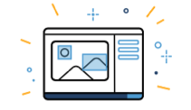
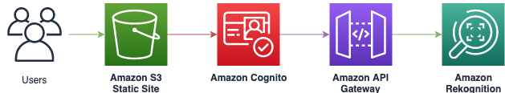

  

<h1 align="center">Amazon Rekognition Custom Labels Demo</h1>

Amazon Rekognition Custom Labels is a feature of Amazon Rekognition that enables customers to build their own specialized machine learning (ML) based image analysis capabilities to detect unique objects and scenes integral to their specific use case. 

Instead of having to train a model from scratch, which requires specialized machine learning expertise and millions of high-quality labeled images, customers can use Amazon Rekognition Custom Labels to achieve state-of-the-art performance for their unique image analysis needs.

This demo allows you to test Custom Labels with models trained by Amazon Rekognition.

### Index

* [Architecture](#architecture)
* [Usage](#usage)
  * [Prerequisites](#prerequisites)
  * [Deployment](#deployment)
  * [Accessing and using the Demo](#accessing-and-using-the-demo)
  * [Stopping a running model](#stopping-a-running-model)
* [Removing the demo application](#removing-the-demo-application)
* [Making changes to the code and customization](#making-changes-to-the-code-and-customization)
* [Contributing](#contributing)

### Architecture

The Custom Labels Demo uses [Amazon Rekognition](https://aws.amazon.com/rekognition) for label recognition, [Amazon Cognito](https://aws.amazon.com/cognito) for authenticating the Service Requests, and [Amazon CloudFront](https://aws.amazon.com/cloudfront), [Amazon S3](https://aws.amazon.com/s3), [AWS Amplify](https://aws.amazon.com/amplify), and [React](https://reactjs.org) for the front-end layer.

  

When accessing the Demo, the frontend app calls the `DescribeProjects` action in Amazon Rekognition. Then, for each project, it calls the `DescribeProjectVersions` action. This is for fetching the list and status of each model in the current account.

In addition to showing all the models, the UI allows to start all the models in the *TRAINING_COMPLETED* or *STOPPED* state by calling the `StartProjectVersion` action.
The UI also allows to stop a model in the *RUNNING* state by calling the `StopProjectVersion` action.

If you have any model in the *RUNNING* state, you can click the title and then select an image from your local machine to detect custom labels. The frontend app will call the `DetectCustomLabels` action in Amazon Rekognition.

To learn more about Custom Labels [consult the documentation](https://docs.aws.amazon.com/rekognition/latest/customlabels-dg/what-is.html).

### Usage

#### Prerequisites

To deploy the sample application you will require an AWS account. If you don’t already have an AWS account, create one at <https://aws.amazon.com> by following the on-screen instructions. Your access to the AWS account must have IAM permissions to launch AWS CloudFormation templates that create IAM roles.

To use the sample application you will require a [modern browser](https://caniuse.com/#search=FileReader%20API).

#### Deployment

The demo application is deployed as an [AWS CloudFormation](https://aws.amazon.com/cloudformation) template.

> **Note**  
You are responsible for the cost of the AWS services used while running this sample deployment. There is no additional cost for using this sample. For full details, see the following pricing pages for each AWS service you will be using in this sample.  Prices are subject to change.
> * [Amazon Rekognition Pricing](https://aws.amazon.com/rekognition/pricing/)
> * [Amazon S3 Pricing](https://aws.amazon.com/s3/pricing/)
> * [Amazon Cognito Pricing](https://aws.amazon.com/cognito/pricing/)
> * [Amazon CloudFront Pricing](https://aws.amazon.com/cloudfront/pricing/)

1. Deploy the latest CloudFormation template by following the link below for your preferred AWS region:

|Region|Launch Template|
|------|---------------|
|**US East (N. Virginia)** (us-east-1) | |
|**US East (Ohio)** (us-east-2) | |
|**US West (Oregon)** (us-west-2) | |
|**EU (Ireland)** (eu-west-1) | |
|**Asia Pacific (Mumbai)** (ap-south-1) | |

2. If prompted, login using your AWS account credentials.
3. You should see a screen titled "*Create Stack*" at the "*Specify template*" step. The fields specifying the CloudFormation template are pre-populated. Click the **Next** button at the bottom of the page.
4. On the "*Specify stack details*" screen you may customize the following parameters of the CloudFormation stack:
   * **Stack Name:** (Default: *CustomLabelsDemo*) This is the name that is used to refer to this stack in CloudFormation once deployed. The value must be 15 characters or less.
   * **AdminEmail:** This is the e-mail address used to create the Admin User in the Cognito User Pool.
   * **ResourcePrefix:** (Default: *RekogCustomLabelsDemo*) AWS Resources are named based on the value of this parameter. You must customise this if you are launching more than one instance of the stack within the same account.
   * **CreateCloudFrontDistribution**  (Default: *true*) Creates a CloudFront distribution for accessing the web interface of the demo. This must be enabled if S3 Block Public Access is enabled at an account level. **Note:** Creating a CloudFront distribution may significantly increase the deploy time (from approximately 5 minutes to over 30 minutes).

   When completed, click **Next**
5. [Configure stack options](https://docs.aws.amazon.com/AWSCloudFormation/latest/UserGuide/cfn-console-add-tags.html) if desired, then click **Next**.
6. On the review you screen, you must check the boxes for:
   * "*I acknowledge that AWS CloudFormation might create IAM resources*" 
   * "*I acknowledge that AWS CloudFormation might create IAM resources with custom names*"
   * "*I acknowledge that AWS CloudFormation might require the following capability: CAPABILITY_AUTO_EXPAND*"

   These are required to allow CloudFormation to create the IAM roles specified in the CloudFormation using both fixed and dynamic names.
7. Click **Create Change Set**
8. On the *Change Set* screen, click **Execute** to launch your stack.
   * You may need to wait for the *Execution status* of the change set to become "*AVAILABLE*" before the "**Execute**" button becomes available.
9. Wait for the CloudFormation stack to launch. Completion is indicated when the "Stack status" is "*CREATE_COMPLETE*".
   * You can monitor the stack creation progress in the "Events" tab.
10. Note the *url* displayed in the *Outputs* tab for the stack. This is used to access the application.

#### Accessing and using the Demo

To use the Demo, you need models trained by Amazon Rekognition. Consult the [Getting Started Documentation](https://docs.aws.amazon.com/rekognition/latest/customlabels-dg/getting-started.html) to learn how to create and train an Amazon Rekognition Custom Labels model.

Once deployed, the application can be accessed using a web browser using the address specified in `url` output from the CloudFormation stack created during [deployment](#deployment) of the solution.

When accessing the application for the first time, you need to use the Admin e-mail provided during Stack Creation as username. A temporary password will be sent to the same e-mail address. After authentication, it will be necessary to create a new password and click "Change".

To manage users, you can use the [Cognito Users Pool console](https://console.aws.amazon.com/cognito/users).

### Removing the demo application

To remove the demo application, open the AWS CloudFormation Console, click the **CustomLabelsDemo** project then right-click and select "*Delete Stack*". Your stack will take some time to be deleted. You can track its progress in the "*Events*" tab. Once the stack deletion is complete, the status will change from "*DELETE_IN_PROGRESS*" to "*DELETE_COMPLETE*". It will then disappear from the list.

### Making changes to the code and customization

The [contributing guidelines](CONTRIBUTING.md) contain instructions about how to run the front-end locally and make changes to the backend stack.

## Contributing

Contributions are more than welcome. Please read the [code of conduct](CODE_OF_CONDUCT.md) and the [contributing guidelines](CONTRIBUTING.md).

## License Summary

This project is licensed under the Apache-2.0 License.
