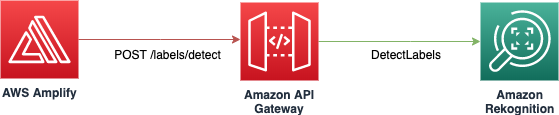

## Amazon Rekognition Custom Labels Demo

> TODO: Description

### Index

* [Architecture](#architecture)
* [Usage](#usage)
  * [Prerequisites](#prerequisites)
  * [Deployment](#deployment)
  * [Accessing the application](#accessing-the-application)
* [Remove the application](#remove-the-application)
* [Making changes to the code and customization](#making-changes-to-the-code-and-customization)
* [Contributing](#contributing)

### Architecture

The Custom Labels Demo uses [Amazon Rekognition](https://aws.amazon.com/rekognition) for label recognition, [Amazon API Gateway](https://aws.amazon.com/api-gateway) and [Amazon Cognito](https://aws.amazon.com/cognito) for the API, and [Amazon S3](https://aws.amazon.com/s3), [AWS Amplify](https://aws.amazon.com/amplify), and [React](https://reactjs.org) for the front-end layer.

There are two ways to use the application:
* the **"Image Mode"** allows to detect custom labels by uploading an Image
* the **"Webcam Mode"** allows to detect custom labels by using a WebCam (the label detection happens every second)

The diagram below represents the API calls performed by Amplify, which takes care of authenticating all the calls to the API Gateway using Cognito.

> TODO: Update Flow Diagram

#### The "Image Mode"

After selecting an image from your local machine, Amplify makes a `POST /labels/detect` request to the API Gateway including the uploaded picture, then the API Gateway calls the `DetectLabels` action in Amazon Rekognition. To learn more about *DetectLabels* [see the Rekognition documentation](https://docs.aws.amazon.com/rekognition/latest/dg/API_DetectLabels.html).

> TODO: Update with Custom Labels

#### The "Webcam Mode"

After clicking the "Start Rekognition" button, Amplify makes a `POST /labels/detect` request to the API Gateway including a snapshot from the webcam, then the API Gateway calls the `DetectLabels` action in Amazon Rekognition. Amplify makes another request with a new snapshot every second, unless the "Stop Rekognition" button is clicked again. To learn more about *DetectLabels* [see the Rekognition documentation](https://docs.aws.amazon.com/rekognition/latest/dg/API_DetectLabels.html).

> TODO: Update with Custom Labels

### Usage

#### Prerequisites

To deploy the sample application you will require an AWS account. If you don’t already have an AWS account, create one at <https://aws.amazon.com> by following the on-screen instructions. Your access to the AWS account must have IAM permissions to launch AWS CloudFormation templates that create IAM roles.

To use the sample application you will require a [modern browser](https://caniuse.com/#feat=stream) and a webcam.

#### Deployment

The demo application is deployed as an [AWS CloudFormation](https://aws.amazon.com/cloudformation) template.

> **Note**  
You are responsible for the cost of the AWS services used while running this sample deployment. There is no additional cost for using this sample. For full details, see the pricing pages for each AWS service you will be using in this sample. Prices are subject to change.

1. Deploy the latest CloudFormation template by following the link below for your preferred AWS region:

|Region|Launch Template|
|------|---------------|
|**US East (N. Virginia)** (us-east-1) | |
|**US East (Ohio)** (us-east-2) | |
|**US West (Oregon)** (us-west-2) | |
|**Asia Pacific (Seoul)** (ap-northeast-2) | |
|**Asia Pacific (Sydney)** (ap-southeast-2) | |
|**Asia Pacific (Tokyo)** (ap-northeast-1) | |
|**EU (Ireland)** (eu-west-1) | |

2. If prompted, login using your AWS account credentials.
1. You should see a screen titled "*Create Stack*" at the "*Specify template*" step. The fields specifying the CloudFormation template are pre-populated. Click the *Next* button at the bottom of the page.
1. On the "*Specify stack details*" screen you may customize the following parameters of the CloudFormation stack:
   * **Stack Name:** (Default: CustomLabelsDemo) This is the name that is used to refer to this stack in CloudFormation once deployed. The value must be 15 characters or less.
   * **CollectionId:** (Default: RekogCustomLabelsDemo) AWS Resources are named based on the value of this parameter. You must customise this if you are launching more than one instance of the stack within the same account.
   * **CreateCloudFrontDistribution**  (Default: false) Creates a CloudFront distribution for accessing the web interface of the demo. This must be enabled if S3 Block Public Access is enabled at an account level. **Note:** Creating a CloudFront distribution may significantly increase the deploy time (from approximately 5 minutes to over 30 minutes)

   When completed, click *Next*
1. [Configure stack options](https://docs.aws.amazon.com/AWSCloudFormation/latest/UserGuide/cfn-console-add-tags.html) if desired, then click *Next*.
1. On the review you screen, you must check the boxes for:
   * "*I acknowledge that AWS CloudFormation might create IAM resources*" 
   * "*I acknowledge that AWS CloudFormation might create IAM resources with custom names*" 

   These are required to allow CloudFormation to create a Role to allow access to resources needed by the stack and name the resources in a dynamic way.
1. Click *Create Change Set* 
1. On the *Change Set* screen, click *Execute* to launch your stack.
   * You may need to wait for the *Execution status* of the change set to become "*AVAILABLE*" before the "*Execute*" button becomes available.
1. Wait for the CloudFormation stack to launch. Completion is indicated when the "Stack status" is "*CREATE_COMPLETE*".
   * You can monitor the stack creation progress in the "Events" tab.
1. Note the *url* displayed in the *Outputs* tab for the stack. This is used to access the application.

#### Accessing the Application

The application is accessed using a web browser. The address is the *url* output from the CloudFormation stack created during the Deployment steps.

* When accessing the application, the browser will ask you the permission for using your camera. You will need to click "*Allow*" for the application to work.
* Click "*Image Mode*" and then upload a picture (JPG and PNG formats are accepted) if you wish to detect the custom labels from a picture.
* Click "*Webcam Mode*" and then click "*Start Rekognition*" if you wish to detect the custom labels from snapshots taken from your webcam.

### Remove the application

To remove the application open the AWS CloudFormation Console, click the CustomLabelsDemo project, right-click and select "*Delete Stack*". Your stack will take some time to be deleted. You can track its progress in the "Events" tab. When it is done, the status will change from DELETE_IN_PROGRESS" to "DELETE_COMPLETE". It will then disappear from the list.

### Making changes to the code and customization

The [contributing guidelines](CONTRIBUTING.md) contains some instructions about how to run the front-end locally and make changes to the back-end stack.

## Contributing

Contributions are more than welcome. Please read the [code of conduct](CODE_OF_CONDUCT.md) and the [contributing guidelines](CONTRIBUTING.md).

## License Summary

This sample code is made available under a modified MIT license. See the LICENSE file.
